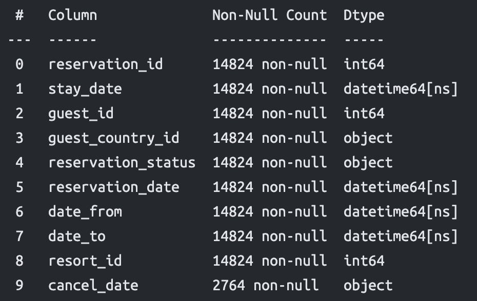

# Hotel Occupancy Prediction

## Overview
This project aims to predict hotel occupancy using a combination of ARIMA (AutoRegressive Integrated Moving Average) models and mathematical techniques to add conformal predictions. 
The goal is to provide accurate occupancy forecasts that can assist hotel management in optimizing resource allocation and improving overall efficiency.

## Table of Contents
- [Overview](#overview)
- [Dependencies](#dependencies)
- [Installation](#installation)
- [Data](#data)
- [Usage](#usage)
- [Models](#models)
- [Results](#results)
- [Example](#example)
- [Contributing](#contributing)
- [License](#license)
- [Contact](#contact)

## Dependencies
- Python 3.x
- JupyterLab
- pandas
- numpy
- statsmodels
- scikit-learn
- scipy
- matplotlib
- seaborn
- pmdarima
- tensorflow
- prophet

## Installation
1. Clone the repository: git clone https://github.com/your_username/hotel-occupancy-prediction.git
2. Install the required dependencies: pip install -r requirements.txt

## Data
The data set used in this project should contain historical hotel occupancy data. Ensure that the data includes relevant features and that the features are correctly named.

## Usage
To use the hotel occupancy prediction model:
1. Prepare your data set containing historical hotel occupancy data by renaming the columns as expected(check [Example](#example)).
2. Run the ARIMA model with conformal predictions:

3. Analyze the results.
4. Adjust parameters and re-run the model if not satisfied.

## Models
This project utilizes the following models:
- ARIMA: A basic time series forecasting model used to capture temporal patterns in the occupancy data.
- Conformal Prediction: Mathematical techniques are applied to provide prediction intervals along with point predictions, allowing for uncertainty quantification.

## Results
The results of the occupancy predictions will include point forecasts as well as prediction intervals, providing insights into the expected occupancy levels along with measures of uncertainty. 

## Example
First the columns of the data set need to be named as following:

## Contributing
Contributions to this project are welcome! If you have suggestions for improvements or would like to report issues, please submit a pull request or open an issue on GitHub.

## License
This project is licensed under the [GPL-3.0 License](LICENSE).

## Contact
For any questions or inquiries about this project, please contact the contributors.

## Contributors
Kukić Matija Luka -- matija-luka.kukic@fer.hr;
Baričević Dora -- dora.baricevic@fer.hr;
Vidović Valentina -- valvido.math@pmf.hr;
Džanija Ivan -- ivan.dzanija@fer.hr;

